# 4.8 - Diagrama de Classes Geral

## Objetivo
Apresentar a visão unificada e em alto nível do modelo de classes (paradigma de Orientação a Objetos) do sistema Fluxo Bank, consolidando todas as partes isoladas apresentadas anteriormente (CLS-01 a CLS-04) em um único diagrama arquitetural coerente e validado.

## Resumo das Decisões de Refatoração Conceitual

1. **Credenciais (E-mail):** O atributo `email` foi posicionado de forma exclusiva na classe `Usuario`, que possui responsabilidade de gerenciar as credenciais e o processo de autenticação (Sanctum/2FA). A consolidação remove a duplicidade de email identificada nos diagramas anteriores, mantendo a credencial na entidade Usuario conforme o fluxo de autenticação.
2. **Herança de Cartões:** A herança entre `Cartao`, `CartaoDebito` e `CartaoCredito` é expressa na orientação a objetos (Generalização/Especialização), com as formas física e virtual sendo associadas adequadamente (1:1 e 1:0..1).
3. **Herança de Clientes:** `ClientePF` e `ClientePJ` herdam da classe abstrata `Cliente`. O atributo `razaoSocial` pertence exclusivamente a `ClientePJ`, e `cpf` a `ClientePF`, eliminando a redundância da modelagem original.
4. **Herança de Contas:** Diferentes especialidades herdam de `Conta` sem redefinição redundante do controle de bloqueio.
5. **Núcleo Contábil Restrito:** Sem coluna ou atributo livre de `saldo` em `Conta`. Lançamentos determinam e compõem o saldo contábil via Partidas Dobradas.
6. **Entidade `Retirada` Mantida:** Entidade prevista na modelagem existente, embora o UCD atual não possua caso de uso específico correspondente. Manteve-se no modelo por ter vasto suporte de regras (RN18) e diagramas associados ao processo.

## Diagrama de Classes UML (Mermaid)

```mermaid
classDiagram
    %%-------------------------
    %% Autenticação e Segurança
    %%-------------------------
    class Usuario {
        - id: uuid
        - email: string
        - senhaHash: string
        - perfil: string
        - doisFatoresAtivo: boolean
        - tentativas: int
        - bloqueadoAte: timestamp
        - tokenAcesso: string
        + autenticar(email, senha)
    }

    class VerificacaoDoisFatores {
        - id: uuid
        - canal: string
        - finalidade: string
        - codigoHash: string
        - expiraEm: timestamp
        - tentativas: int
        - utilizadoEm: timestamp
        + gerar()
        + validar()
    }

    class DispositivoConfiavel {
        - id: uuid
        - fingerprint: string
        - ultimoUso: timestamp
        - revogadoEm: timestamp
        + ehConfiavel() boolean
    }

    class LogAuditoria {
        <<append-only>>
        - id: uuid
        - evento: string
        - antes: jsonb
        - depois: jsonb
        - hash: string
        - ip: string
        - userAgent: string
        - categoria: string
        + registrar()
    }

    Usuario "1" *-- "0..*" VerificacaoDoisFatores : solicita
    Usuario "1" *-- "0..*" DispositivoConfiavel : confia

    %%-------------------------
    %% Clientes e Herança
    %%-------------------------
    class Cliente {
        <<abstract>>
        - id: uuid
        - nome: string
        - status: string
    }

    class ClientePF {
        - cpf: string
        - dataNascimento: date
    }

    class ClientePJ {
        - razaoSocial: string
        - cnpj: string
        - representanteLegal: string
    }

    Cliente <|-- ClientePF
    Cliente <|-- ClientePJ
    Cliente "1" -- "1" Usuario : possui

    %%-------------------------
    %% Assinaturas
    %%-------------------------
    class Plano {
        - id: uuid
        - nome: string
        - mensalidade: numeric
        - limiteRetiradas: int
        - ativo: boolean
    }

    class Assinatura {
        - id: uuid
        - dataInicio: date
        - dataFim: date
        - diaCobranca: int
        - status: string
        - valorAtual: numeric
        + recalcularValor()
    }

    class Item {
        - id: uuid
        - nome: string
        - valorUnitario: numeric
    }

    class ItemAssinatura {
        <<associativa>>
        - dataExclusao: date
        - motivoExclusao: string
    }

    class Cobranca {
        - id: uuid
        - competencia: string
        - valor: numeric
        - vencimento: date
        - status: string
    }

    Cliente "1" -- "0..*" Assinatura : contrata
    Plano "1" -- "0..*" Assinatura : baseia
    Assinatura "1" *-- "0..*" ItemAssinatura : contem
    Item "1" -- "0..*" ItemAssinatura : referenciado
    Assinatura "1" *-- "0..*" Cobranca : gera

    %%-------------------------
    %% Contas e Núcleo Contábil
    %%-------------------------
    class Conta {
        <<abstract>>
        - id: uuid
        - agencia: string
        - numero: string
        - status: string
        - bloqueada: boolean
        + bloquear(motivo)
        + podeDebitar() boolean
    }

    class ContaCorrente {
    }

    class ContaPoupanca {
        - aniversarioRendimento: date
    }

    class ContaSalario {
        - restricaoSaque: boolean
    }

    class ContaPJ {
        - cnpjVinculado: string
    }

    Conta <|-- ContaCorrente
    Conta <|-- ContaPoupanca
    Conta <|-- ContaSalario
    Conta <|-- ContaPJ
    Cliente "1" -- "0..*" Conta : titular

    class Transacao {
        - id: uuid
        - tipo: string
        - status: string
        - chaveIdempotencia: string
        - criadoEm: timestamp
        + efetivar()
    }

    class Lancamento {
        - id: uuid
        - natureza: string
        - valor: numeric
    }

    class Retirada {
        - id: uuid
        - valor: numeric
        - canal: string
        - status: string
        - codigoRetirada: string
        - expiraEm: timestamp
        - chaveIdempotencia: string
        + exigirVerificacao()
        + confirmar()
    }

    class ChavePix {
        - id: uuid
        - tipoChave: string
        - valorChave: string
        - registradoEm: timestamp
        + validarDuplicidade()
    }

    class AvisoViagem {
        - id: uuid
        - dataInicio: date
        - dataFim: date
        - localidades: string
        - ativo: boolean
        + cobreLocalizacao(local) boolean
    }

    class Agendamento {
        - id: uuid
        - tipoOperacao: string
        - valor: numeric
        - dataAgendada: date
        - payloadOperacao: jsonb
        - status: string
        - recorrente: boolean
        + executar()
    }

    class ChamadoSuporte {
        - id: uuid
        - assunto: string
        - descricao: string
        - anexoUrl: string
        - status: string
        + atender()
        + concluir()
    }

    Transacao "1" *-- "2..*" Lancamento : compoe (partidas dobradas)
    Conta "1" -- "0..*" Lancamento : sofre
    Conta "1" -- "0..*" Retirada : origina
    Conta "1" -- "0..*" ChavePix : possui
    Conta "1" -- "0..*" AvisoViagem : registra
    Conta "1" -- "0..*" Agendamento : programa
    Cliente "1" -- "0..*" ChamadoSuporte : abre

    %%-------------------------
    %% Cartões
    %%-------------------------
    class Cartao {
        <<abstract>>
        - id: uuid
        - numeroMascarado: string
        - validade: date
        - cvvHash: string
        - status: string
    }

    class CartaoDebito {
    }

    class CartaoCredito {
        - limiteAprovado: numeric
        - diaFechamentoFatura: int
    }

    class CartaoFisico {
        - id: uuid
        - dataEntrega: date
        - enderecoEntrega: string
    }

    class CartaoVirtual {
        - id: uuid
        - geradoEm: timestamp
        + gerarAPartirDoFisico()
    }

    Cartao <|-- CartaoDebito
    Cartao <|-- CartaoCredito
    Conta "1" -- "0..*" Cartao : emite
    Cartao "1" -- "1" CartaoFisico : possui
    CartaoFisico "1" -- "0..1" CartaoVirtual : origina
```

