# 4.7 - Diagrama Entidade-Relacionamento (DER)

## Objetivo
O presente documento apresenta o Diagrama Entidade-Relacionamento do sistema, refletindo a estrutura de persistência no banco de dados relacional. Ele é estritamente derivado da documentação de requisitos e da modelagem de classes, traduzindo o paradigma de orientação a objetos para o modelo físico.

## Entidades Principais e Estratégias de Persistência

1. **Clientes (STI - Single Table Inheritance)**
   A herança entre `Cliente`, `ClientePF` e `ClientePJ` foi mapeada para uma única tabela `CLIENTES`, usando a coluna `tipo_cliente` como discriminador.

2. **Cartões (STI + Tabelas Dependentes)**
   A herança lógica de cartões de débito e crédito foi unificada na tabela `CARTOES` com a coluna discriminadora `modalidade`. Suas formas físicas e virtuais foram mapeadas em tabelas próprias (`CARTOES_FISICOS` e `CARTOES_VIRTUAIS`), uma vez que possuem ciclos de vida e restrições independentes.

3. **Núcleo Contábil (RN02 e RN03)**
   O modelo é baseado em partidas dobradas. A tabela `CONTAS` não armazena saldo de forma persistida. O saldo da conta não é armazenado como atributo persistido; ele é derivado da agregação dos lançamentos vinculados à conta (`LANCAMENTOS`), considerando a natureza débito/crédito de cada lançamento. Cada transação agrupa seus lançamentos. A RN03 estabelece como restrição de integridade (invariante contábil) que a soma dos lançamentos de uma transação deve permanecer sempre balanceada.

4. **Itens de Assinatura (RN22)**
   A associação entre assinaturas e itens (`ITENS_ASSINATURA`) foi projetada sem exclusão física (DELETE); utiliza exclusão lógica/soft delete por meio dos atributos previstos pela modelagem (`data_exclusao` e `motivo_exclusao`).

5. **Credenciais (E-mail)**
   Para evitar duplicidade, o campo `email` está centralizado exclusivamente na entidade `USUARIOS`, que atua como dona da credencial de autenticação, conforme evidenciado no fluxo de login (`seq-02-login-2fa.svg`). A tabela `CLIENTES` acessa esse dado via relacionamento 1:1.

## Diagrama DER (Mermaid)

```mermaid
erDiagram
    USUARIOS {
        uuid id PK
        uuid cliente_id FK
        string email
        string senha_hash
        string perfil
        boolean dois_fatores_ativo
        int tentativas
        timestamp bloqueado_ate
        string token_acesso
    }

    CLIENTES {
        uuid id PK
        string tipo_cliente "PF ou PJ"
        string nome
        string razao_social
        string cpf
        string cnpj
        date data_nascimento
        string representante_legal
        string status
    }

    CONTAS {
        uuid id PK
        uuid cliente_id FK
        string tipo_conta
        string agencia
        string numero
        string status
        boolean bloqueada
        string cnpj_vinculado
        date aniversario_rendimento
        boolean restricao_saque
    }

    TRANSACOES {
        uuid id PK
        string tipo
        string status
        string chave_idempotencia
        timestamp criado_em
    }

    LANCAMENTOS {
        uuid id PK
        uuid transacao_id FK
        uuid conta_id FK
        string natureza "DEBITO ou CREDITO"
        numeric valor
    }

    CARTOES {
        uuid id PK
        uuid conta_id FK
        string modalidade "DEBITO ou CREDITO"
        string numero_mascarado
        date validade
        string cvv_hash
        string status
        numeric limite_aprovado
        int dia_fechamento_fatura
    }

    CARTOES_FISICOS {
        uuid id PK
        uuid cartao_id FK
        date data_entrega
        string endereco_entrega
    }

    CARTOES_VIRTUAIS {
        uuid id PK
        uuid cartao_fisico_id FK
        timestamp gerado_em
    }

    PLANOS {
        uuid id PK
        string nome
        numeric mensalidade
        int limite_retiradas
        boolean ativo
    }

    ASSINATURAS {
        uuid id PK
        uuid cliente_id FK
        uuid plano_id FK
        date data_inicio
        date data_fim
        int dia_cobranca
        string status
        numeric valor_atual
    }

    ITENS {
        uuid id PK
        string nome
        numeric valor_unitario
    }

    ITENS_ASSINATURA {
        uuid assinatura_id PK, FK
        uuid item_id PK, FK
        date data_exclusao
        string motivo_exclusao
    }

    COBRANCAS {
        uuid id PK
        uuid assinatura_id FK
        string competencia
        numeric valor
        date vencimento
        string status
    }

    VERIFICACAO_DOIS_FATORES {
        uuid id PK
        uuid usuario_id FK
        string canal
        string finalidade
        string codigo_hash
        timestamp expira_em
        int tentativas
        timestamp utilizado_em
    }

    RETIRADAS {
        uuid id PK
        uuid conta_id FK
        numeric valor
        string canal
        string status
        string codigo_retirada
        timestamp expira_em
        string chave_idempotencia
    }

    DISPOSITIVOS_CONFIAVEIS {
        uuid id PK
        uuid usuario_id FK
        string fingerprint
        timestamp ultimo_uso
        timestamp revogado_em
    }

    LOGS_AUDITORIA {
        uuid id PK
        string evento
        jsonb antes
        jsonb depois
        string hash
        string ip
        string user_agent
        string categoria
    }

    CHAVES_PIX {
        uuid id PK
        uuid conta_id FK
        string tipo_chave "CPF, EMAIL, CELULAR, ALEATORIA"
        string valor_chave
        timestamp registrado_em
    }

    AVISOS_VIAGEM {
        uuid id PK
        uuid conta_id FK
        date data_inicio
        date data_fim
        string localidades
        boolean ativo
    }

    CHAMADOS_SUPORTE {
        uuid id PK
        uuid cliente_id FK
        string assunto
        string descricao
        string anexo_url
        string status
        timestamp criado_em
    }

    AGENDAMENTOS {
        uuid id PK
        uuid conta_id FK
        string tipo_operacao
        numeric valor
        date data_agendada
        jsonb payload_operacao
        string status
        boolean recorrente
    }

    CLIENTES ||--|| USUARIOS : "possui credenciais"
    CLIENTES ||--o{ CONTAS : "titular"
    CLIENTES ||--o{ ASSINATURAS : "contrata"
    CLIENTES ||--o{ CHAMADOS_SUPORTE : "abre"
    
    CONTAS ||--o{ LANCAMENTOS : "recebe"
    CONTAS ||--o{ CARTOES : "emite"
    CONTAS ||--o{ RETIRADAS : "sofre"
    CONTAS ||--o{ CHAVES_PIX : "possui"
    CONTAS ||--o{ AVISOS_VIAGEM : "registra"
    CONTAS ||--o{ AGENDAMENTOS : "programa"
    
    TRANSACOES ||--|{ LANCAMENTOS : "agrupa (partidas dobradas)"
    
    CARTOES ||--|| CARTOES_FISICOS : "possui"
    CARTOES_FISICOS ||--o| CARTOES_VIRTUAIS : "gera (RN33)"
    
    PLANOS ||--o{ ASSINATURAS : "baseia"
    ASSINATURAS ||--o{ ITENS_ASSINATURA : "contem"
    ITENS ||--o{ ITENS_ASSINATURA : "incluso em"
    ASSINATURAS ||--o{ COBRANCAS : "fatura"
    
    USUARIOS ||--o{ VERIFICACAO_DOIS_FATORES : "solicita"
    USUARIOS ||--o{ DISPOSITIVOS_CONFIAVEIS : "cadastra"
```

