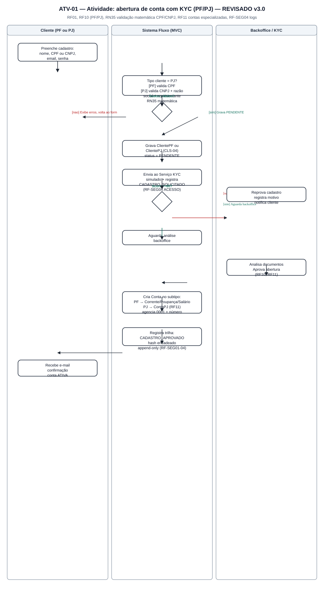
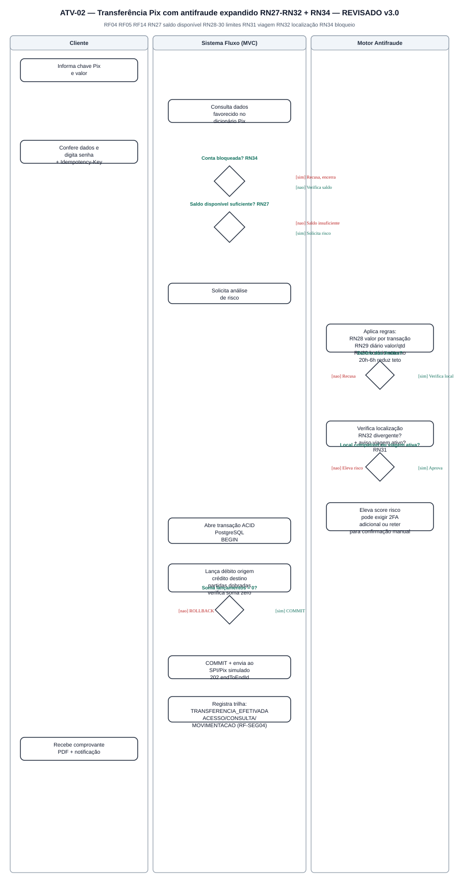
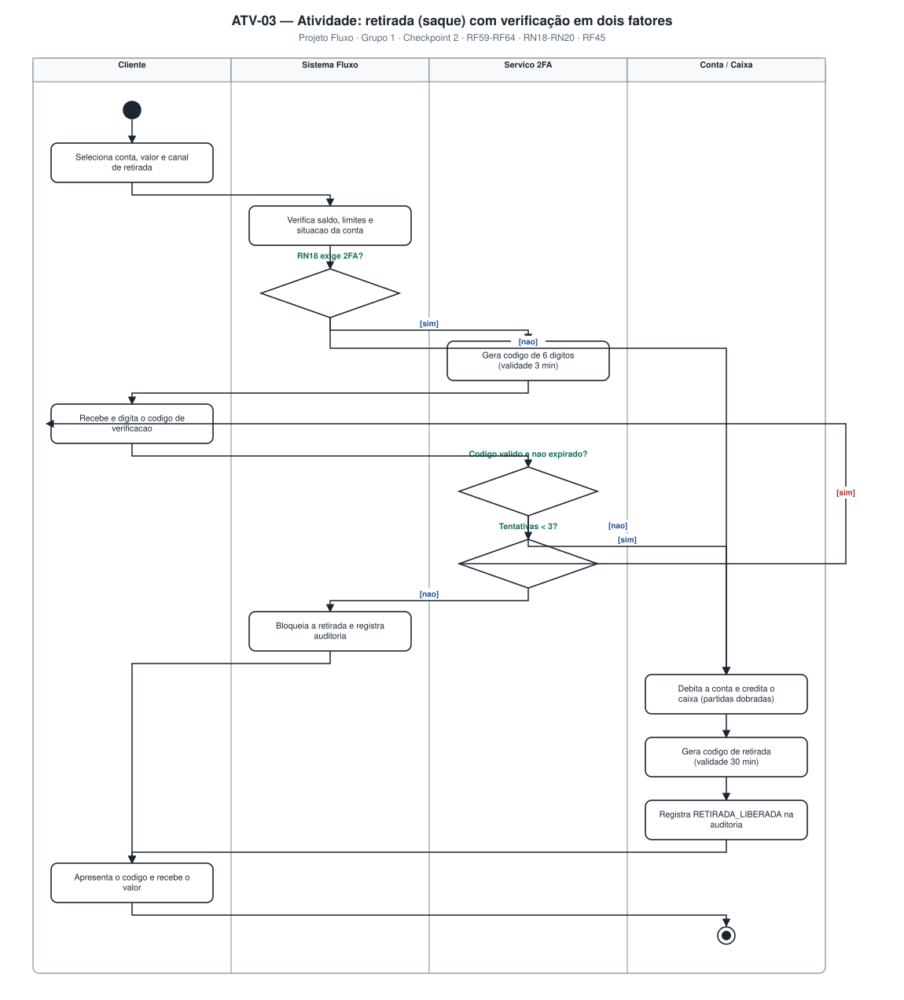
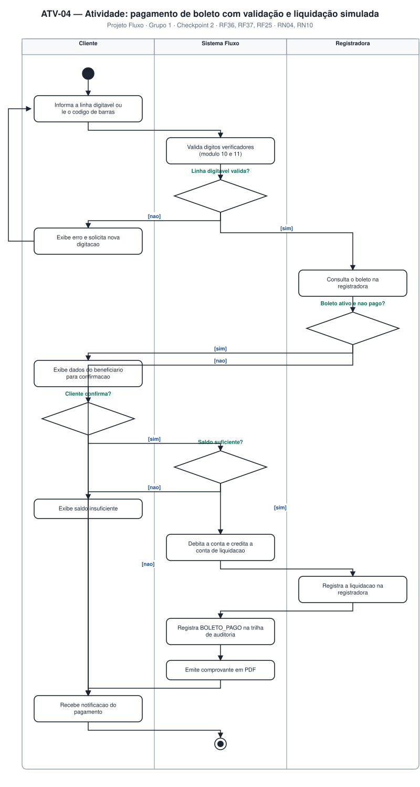
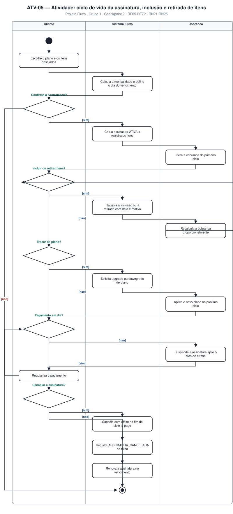
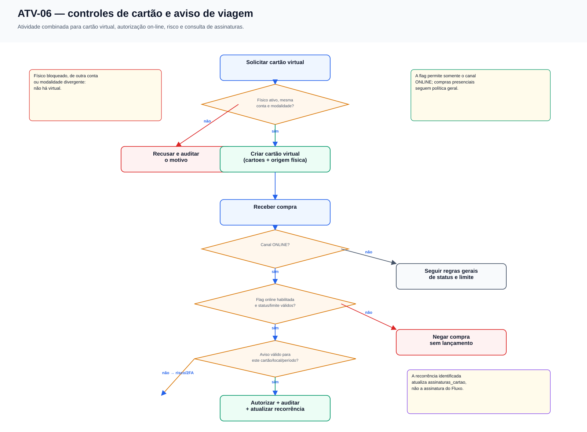

# 4.3 — Diagramas de Atividades (UML)

## 1. Sumário

| ID | Diagrama | Raias | Requisitos | Imagem |
|---|---|---|---|---|
| ATV-01 | Abertura de conta com KYC | Cliente · Sistema · Backoffice | RF01, RF10 | `diagramas/atv-01-abertura-conta.svg` |
| ATV-02 | Transferência Pix com análise de risco | Cliente · Sistema · Motor Antifraude | RF04, RF05, RN27–RN32 | `diagramas/atv-02-transferencia-pix.svg` |
| ATV-03 | Retirada (saque) com 2FA | Cliente · Sistema · Serviço 2FA · Conta/Caixa | RF07 | `diagramas/atv-03-retirada-2fa.svg` |
| ATV-04 | Pagamento de boleto | Cliente · Sistema · Registradora | RF08 | `diagramas/atv-04-pagamento-boleto.svg` |
| ATV-05 | Ciclo da assinatura e retirada de itens | Cliente · Sistema · Cobrança | RN21–RN25 | `diagramas/atv-05-assinatura.svg` |
| ATV-06 | Cartão, autorização on-line e aviso de viagem | Cliente · Sistema · Antifraude · Adquirente | RF19, RF20, RF21, RF24 | `diagramas/atv-06-controles-cartao.svg` |

---

## 2. ATV-01 — Abertura de conta com KYC

| Decisão | `[nao]` | `[sim]` |
|---|---|---|
| Tipo de cliente = PJ? *(revisão)* | Valida CPF (RF10) | Valida CNPJ + razão social/representante legal (RF10) |
| Dados válidos? | Exibe erros, devolve ao formulário | Grava `status = PENDENTE`, `status_abertura = PENDENTE_KYC`, envia ao KYC |
| Score ≥ 60? | Reprova e notifica | Aguarda análise do backoffice |

**Regras:** RN01 (ativação só após aprovação) · RF02 (CPF/CNPJ e unicidade antes de gravar) · RF10 (especialização PF/PJ) · senha com bcrypt custo 12.

---

## 3. ATV-02 — Transferência Pix *(detalhado)*

| Decisão | `[nao]` | `[sim]` |
|---|---|---|
| Conta bloqueada pelo cliente? *(novo, RN34)* | Segue para verificação de saldo | Recusa a operação e encerra |
| Saldo disponível suficiente? *(novo, RN27)* | Recusa, notifica "saldo insuficiente" | Segue para o Motor Antifraude |
| Há chave Pix ativa na conta de origem? *(RN42)* | Seleciona `limite_sem_chave_*` | Seleciona limite padrão da janela |
| Dentro dos limites (valor, diário, quantidade, horário)? *(RN28–RN30, RN42–RN43)* | Recusa e libera reserva | Verifica localização |
| Localização compatível ou aviso de viagem ativo para este cartão? *(RN31/RN32/RN44)* | Eleva risco — pode exigir 2FA adicional ou reter | Abre transação ACID e lança débito/crédito |
| Operação é futura? *(RF25)* | Executa Pix imediato | Cria `AGENDADO` e worker processa depois |
| Soma dos lançamentos = 0? | `ROLLBACK` + notificação de falha | `COMMIT`, envio ao SPI/Pix, auditoria, comprovante |

**Regras:** RN02/RN03 (partidas dobradas) · RN27 (saldo disponível) · RN28–RN30 (limites de valor/diário/horário) · RN31/RN32 (viagem/localização) · RN34 (bloqueio de conta) · ACID e idempotência.

---

## 4. ATV-03 — Retirada com 2FA

| Decisão | `[nao]` | `[sim]` |
|---|---|---|
| RN18 exige 2FA? | Vai direto ao débito | Gera e envia código de 6 dígitos |
| Código válido e não expirado? | Verifica tentativas | Debita, credita o caixa, gera código de retirada |
| Tentativas < 3? | Solicita novo código | Bloqueia e registra `RETIRADA_2FA_FALHOU` |

**Regras:** RN18 (gatilhos do 2FA) · RN19 (limite diário) · RN20 (código único, 30 min) · RN26 (3 min, 3 tentativas) · RN34 (conta bloqueada impede a retirada).

---

## 5. ATV-04 — Pagamento de boleto

| Decisão | `[nao]` | `[sim]` |
|---|---|---|
| Linha digitável válida? | Erro, solicita nova digitação | Consulta a registradora |
| Boleto ativo e não pago? | Exibe situação, encerra | Mostra dados para confirmação |
| Cliente confirma? | Encerra sem cobrança | Verifica saldo |
| Saldo suficiente? | "Saldo insuficiente", encerra (RN04) | Debita, credita liquidação, registra |

**Regras:** RF08 (módulo 10/11 antes da consulta externa) · RN04 (sem saldo negativo) · RN10 (correção por estorno, nunca exclusão).

---

## 6. ATV-05 — Ciclo da assinatura e retirada de itens

| Decisão | `[nao]` | `[sim]` |
|---|---|---|
| Confirma a contratação? | Encerra sem cobrança | Cria assinatura `ATIVA`, registra itens |
| Incluir ou retirar item? | Segue para troca de plano | Registra movimentação (data + motivo), recalcula cobrança (realimentação) |
| Trocar de plano? | Segue para pagamento | Upgrade/downgrade com efeito no próximo ciclo |
| Pagamento em dia? | Suspende após 5 dias, cliente regulariza | Segue para cancelamento/renovação |
| Cancelar? | Renova no vencimento | Cancela ao fim do ciclo pago |

**Regras — o coração da "retirada de coisas":**
- **RN22** — retirada de item não apaga o registro: preenche `dataExclusao`/`motivoExclusao`.
- **RN23** — cobrança proporcional aos itens ativos na data do vencimento.
- **RN21** — um único plano ativo por vez; troca cria nova vigência.
- **RN24** — cancelamento vale a partir do fim do ciclo pago.
- **RN25** — atraso > 5 dias suspende a assinatura.

---

## 7. ATV-06 — Cartão, autorização on-line e aviso de viagem

| Decisão | `[não]` | `[sim]` |
|---|---|---|
| Cartão físico ativo para gerar virtual? | Recusa e audita o motivo | Cria instância virtual com a mesma conta/modalidade |
| Compra ocorre no canal `ONLINE`? | Segue as regras gerais de autorização | Verifica `permite_compras_online` |
| Flag on-line habilitada e cartão dentro do limite? | Nega a compra, sem lançamento | Autoriza e registra a movimentação |
| Existe aviso de viagem ativo para este cartão/local/período? | Aumenta risco e pode exigir 2FA | Mantém o risco de localização neutralizado |
| Há recorrência de cobranças? | Não cria assinatura de cartão | Atualiza `assinaturas_cartao` para consulta |

**Regras:** RN38 (virtual depende de físico ativo, mesma conta e modalidade) · RN39 (flag de compras on-line) · RN40 (read model de assinaturas) · RN44 (aviso específico por cartão).

## 8. Rastreabilidade atividade × requisito

| Requisito | ATV-01 | ATV-02 | ATV-03 | ATV-04 | ATV-05 | ATV-06 |
|---|:--:|:--:|:--:|:--:|:--:|:--:|
| RF01, RF10, RF18 (cadastro/KYC, PF/PJ/status) | ✅ | | | | | |
| RF04, RF05, RF23 (Pix/limites) | | ✅ | | | | |
| RF06, RF25 (agendamento) | | ✅ | | | | |
| RF07, RF19, RF20, RF21, RF24 (cartões) | | | | | | ✅ |
| RF08 (boleto) | | | | ✅ | | |
| Módulo de Assinaturas Fluxo | | | | | ✅ | |
| RN01, RN37 | ✅ | | | | | |
| RN02–RN04 | | ✅ | ✅ | ✅ | | |
| RN27–RN32, RN42–RN45 | | ✅ | | | | ✅ |
| RN34 (bloqueio de conta) | | ✅ | ✅ | | | |
| RN18–RN20 (retirada) | | | ✅ | | | |
| RN21–RN25, RN40 | | | | | ✅ | ✅ |
| RN38, RN39, RN44 | | | | | | ✅ |

**Registro de alterações**

| Versão | Data | Alteração |
|---|---|---|
| 1.0 | 31/08/2026 | Versão inicial com 5 diagramas |
| 2.0 | 10/09/2026 | Texto condensado; sem novos diagramas |
| 3.0 | 10/09/2026 | ATV-01 detalhado com PF/PJ; ATV-02 detalhado com saldo disponível, bloqueio de conta e antifraude expandido (RN27–RN32) |
| 4.0 | 08/10/2026 | ATV-06 adicionado para vínculo físico/virtual/conta, flag on-line, aviso de viagem por cartão e read model de assinaturas do cartão; ATV-02 atualizado para limite sem chave, janela e agendamento. |
