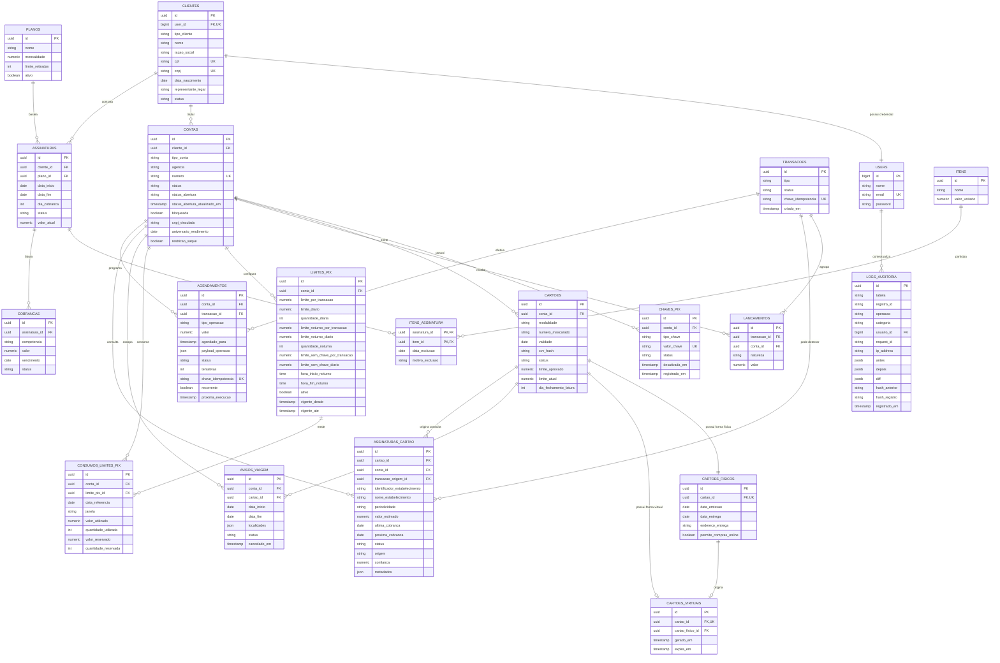

# 4.7 — Diagrama Entidade-Relacionamento (DER)

## Objetivo

Este DER descreve o esquema de persistência do Fluxo após a revisão 4.0. A tabela `contas` mantém o saldo derivado dos lançamentos; as novas entidades atendem ao ciclo de abertura, cartões, limites Pix, aviso de viagem, consulta de assinaturas do cartão, auditoria e agendamento.

> **Implementação:** as tabelas novas estão em `Projeto/backend/database/migrations/2026_10_08_*.php`. O diagrama complementar em [`der-02-requisitos-complementares.svg`](diagramas/der-02-requisitos-complementares.svg) destaca somente as relações adicionadas nesta revisão.

## Estratégias de persistência

1. **Status da conta:** `contas.status` é operacional; `contas.status_abertura` é o fluxo KYC. Uma conta só fica `ATIVA` após abertura aprovada.
2. **Cartões:** `cartoes` representa cada instância lógica e mantém `conta_id`. `cartoes_fisicos` e `cartoes_virtuais` são tabelas de forma; o virtual tem `cartao_id` próprio e `cartao_fisico_id` obrigatório.
3. **Flag on-line:** `cartoes_fisicos.permite_compras_online` começa em `false` e é consultada apenas para autorização em canal `ONLINE`.
4. **Assinaturas:** `assinaturas`/`planos` continuam sendo o produto do Fluxo. `assinaturas_cartao` é um read model de recorrências detectadas nas compras do cartão.
5. **Limites Pix:** `limites_pix` guarda a política vigente; `consumos_limites_pix` guarda o valor/quantidade utilizado e reservado por conta, dia e janela.
6. **Aviso de viagem:** `avisos_viagem.cartao_id` é obrigatório, de modo que a exceção de localização não se espalhe para os demais cartões.
7. **Auditoria:** `logs_auditoria` é escrita por triggers PostgreSQL para alterações de estado e por `AuditoriaService` para acessos/consultas. A própria tabela é append-only.
8. **Agendamento:** `agendamentos` contém a máquina de estados e a chave de idempotência do worker.

## Diagrama DER (Mermaid)

## Dicionário das entidades adicionadas

| Entidade | Regra central |
|---|---|
| `contas.status` / `status_abertura` | Separam ciclo operacional e KYC. |
| `cartoes_virtuais` | `cartao_id` aponta para uma instância com `conta_id`; `cartao_fisico_id` é obrigatório. |
| `cartoes_fisicos.permite_compras_online` | Default `false`; somente canal on-line consulta a flag. |
| `assinaturas_cartao` | Consulta de recorrências de cartão; não substitui `assinaturas`. |
| `limites_pix` / `consumos_limites_pix` | Política e consumo diário/noturno, incluindo ausência de chave ativa. |
| `avisos_viagem` | Um aviso por cartão e período/localidade. |
| `agendamentos` | Fila persistida e idempotente com estados de execução. |
| `logs_auditoria` | OLD/NEW/diff sanitizados, append-only. |

## Rastreabilidade

| Requisito | Entidades / evidências |
|---|---|
| RF18/RN37 | `CONTAS.status`, `CONTAS.status_abertura` |
| RF19/RN38 | `CARTOES`, `CARTOES_FISICOS`, `CARTOES_VIRTUAIS` |
| RF20/RN39 | `CARTOES_FISICOS.permite_compras_online` |
| RF21/RN40 | `ASSINATURAS_CARTAO` separado de `ASSINATURAS` |
| RF22/RN41 | `LOGS_AUDITORIA` e triggers PostgreSQL |
| RF23/RN42–RN43 | `LIMITES_PIX`, `CONSUMOS_LIMITES_PIX`, `CHAVES_PIX.status` |
| RF24/RN44 | `AVISOS_VIAGEM.cartao_id` |
| RF25/RN45 | `AGENDAMENTOS.status`, `chave_idempotencia` |

**Registro de alterações**

| Versão | Data | Alteração |
|---|---|---|
| 3.0 | 10/09/2026 | Especializações de clientes, contas e cartões; auditoria conceitual e agendamento no modelo. |
| 4.0 | 08/10/2026 | Status de abertura, vínculo físico/virtual/conta, flag on-line, read model de assinaturas de cartão, limites Pix por janela/sem chave, aviso por cartão, auditoria implementável e status persistido de agendamento. |
